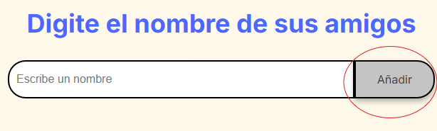

# Sorteo Amigo Secreto

Este proyecto es una página web simple que permite a los usuarios ingresar nombres de amigos en una lista y luego realizar un sorteo aleatorio para determinar quién es el "amigo secreto" de cada persona.

## Características

- **Agregar Amigos:** Los usuarios pueden agregar nombres de amigos a una lista mediante un campo de texto y un botón "Añadir".

- **Lista de Amigos:** Los nombres ingresados se muestran en una lista visible en la página.

- **Sorteo Aleatorio:** Un botón "Sortear Amigo" selecciona un nombre aleatorio de la lista y muestra el resultado en la pantalla.

## Cómo Ejecutar el Proyecto

1. Abre el archivo `index.html` en tu navegador web.
2. Ingresa los nombres de tus amigos en el campo de texto y haz clic en el botón "Añadir" para agregarlos a la lista.
3. Una vez que hayas agregado todos los nombres, haz clic en el botón "Sortear Amigo" para realizar el sorteo.
4. El nombre del amigo secreto se mostrará en la pantalla.

## Posibles Problemas y Soluciones

- **Problema:** No se muestra el nombre del amigo secreto después de hacer clic en "Sortear Amigo".
    - **Solución:** Verifica que hayas agregado al menos un nombre a la lista antes de intentar realizar el sorteo. Asegúrate de que no haya errores en la consola del navegador.
- **Problema:** Los nombres de los amigos se duplican en la lista.
    - **Solución:** Asegúrate de que el campo de texto esté vacío después de agregar un nombre. Si el problema persiste, verifica que la función `actualizarListaAmigos()` esté implementada correctamente.
- **Problema:** Deseo evitar que un amigo se sortee a sí mismo.
    - **Solución:** Se puede implementar una lógica adicional dentro de la función sortearAmigo(), que valide que el nombre sorteado no sea el mismo que el de la persona que esta realizando el sorteo.
- **Problema**: Deseo asignar amigos secretos en lugar de solo mostrar un nombre aleatorio.
    - **Solución**: Se debe crear un algoritmo que asigne un amigo secreto a cada persona en la lista, asegurando que nadie se tenga a sí mismo como amigo secreto.

## Mejoras Futuras

- Añadir estilos CSS para mejorar la apariencia de la página.
- Implementar validaciones adicionales, como evitar nombres duplicados.
- Permitir a los usuarios ingresar sus propios nombres para que el sorteo sea más personalizado.
- Añadir la opción de enviar los resultados del sorteo por correo electrónico.
- Implementar un algoritmo mas complejo para la asignación de amigos secretos.

## Autor

<aside>
✏️

Laura Saavedra

</aside>
